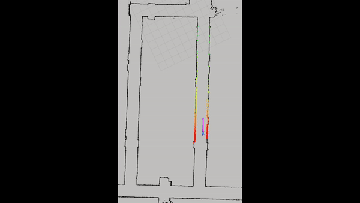

Please refer to [INTRO.md](INTRO.md) for a brief overview of **Model Predictive Control (MPC)** and **Model Predictive Path Integral (MPPI)**, as well as the key distinctions between these two approaches.

## Running the Code

To run this code, you need a working ROS2 environment with the required dependencies installed (e.g., `jax`, `jaxlib`, `numpy`, `rclpy`). Follow these steps:

1. In a new terminal, navigate to the catkin workspace containing the source folder and build the environment: 
```bash
cd $HOME/sim_ws/src
colcon build
```
2. Launch the f1tenth ROS simulator:
```bash
cd $HOME/sim_ws/src
source install/setup.bash
ros2 launch f1tenth_gym_ros gym_bridge_launch.py
```
3. Source the workspace and run the MPPI node: 
```bash
cd $HOME/sim_ws/src
source install/setup.bash
ros2 run f1tenth_mppi mppi_node.py
```

The MPPI planner node will initialize, and once the robot's odometry data starts streaming (from simulation or a real robot), it will compute and publish control commands.

You can visualize the reference waypoints, trajectory, optimal trajectory, and sampled trajectories using tools like RViz or other visualization tools that subscribe to the corresponding ROS topics.

**Note:** The code assumes the availability of robot odometry data and predefined waypoints. You may need to modify the code or provide the required inputs (e.g., waypoints file path, odometry topic) based on your setup and requirements. Additionally, you can adjust various configuration parameters, such as the number of MPPI iterations, samples, prediction horizon, and other algorithm-specific parameters, based on your system dynamics, performance requirements, and desired behavior.


## Demo

Here's a demo of the MPPI planner running in the f1tenth simulator:



And here's a video showing the planner running on a real robot:


# CODE WALKTHROUGH
This repo contains MPPI written in JAX by [Google Research](https://github.com/google-research/google-research/blob/c9f05e51f37cacc291f58799a1f732743625078b/jax_mpc/jax_mpc/mppi.py). JAX is particularly suited for monte-carlo style MPC, as rollouts can be efficiently parallelized using `jax.vmap()`.

# Model Predictive Path Integral (MPPI) Control for F1TENTH Autonomous Racing

This is a detailed tutorial on how to use and walk through the provided code, which is an implementation of the Model Predictive Path Integral (MPPI) control algorithm for trajectory tracking for the F1TENTH autonomous racing platform.

## Understanding MPPI

Before diving into the code, let's first understand the MPPI algorithm and its components:

### What is Model Predictive Control (MPC)?
Model Predictive Control (MPC) is an advanced control technique that uses a system model to predict the future behavior of the system and optimize the control inputs over a receding horizon.

### What is Path Integral Control?
Path Integral Control is a stochastic optimal control technique that uses sampling to compute the optimal control input distribution. MPPI borrows the concept of weighting sampled control sequences based on their associated costs or rewards.

### How does MPPI work?
MPPI is a variant of MPC that uses a sampling-based approach to approximate the optimal control sequence.

1. **Sampling and Weighting**:
The key idea in MPPI is to use sampling to efficiently approximate the optimal control sequence. MPPI generates a set of K candidate control sequences by sampling random variations (noise) around a nominal control sequence. For each candidate sequence, a trajectory is simulated, and the associated cost-to-go (sum of state-dependent costs and control costs) is evaluated.

3. **Optimal Control Update**:  
  The candidate control sequences are weighted based on their associated costs, using the exponential transformation of the cost (similar to the Path Integral Control framework). The optimal control sequence is then computed as a weighted average of the candidate control sequences, where the weights are proportional to the exponential of the negative cost-to-go.

4. **Model Predictive Control (MPC) Setting**:  
  MPPI operates in a Model Predictive Control (MPC) setting, where the optimal control sequence is constantly optimized in the background, and only the first control action is executed. After executing the first control action, the process is repeated with the new state and a shifted control sequence horizon.

5. **Parallel Implementation on GPU**:  
  To enable real-time sampling of thousands of trajectories, which is necessary for good performance, MPPI leverages parallel computing on Graphics Processing Units (GPUs). The candidate trajectory simulations are performed in parallel using vectorization techniques.

6. **Cost Function Design**:  
   MPPI can handle non-smooth cost functions, such as impulse costs for hitting obstacles, which are difficult for traditional gradient-based optimization methods. This is because MPPI does not rely on derivatives of the cost function; it only requires evaluating the cost-to-go for each sampled trajectory.

By combining the Path Integral Control framework with sampling, GPU parallelization, MPPI can effectively optimize control sequences for non-linear systems with non-smooth cost functions.

## Code Walkthrough

### 1. `MPPI Class`
This class implements the MPPI algorithm with methods for state initialization, state update, and optimal control action computation.. Here's a breakdown of the essential components:

- `init_state`: Initializes the MPPI state, including the optimal control sequence and covariance matrices (if adaptive covariance is used).
- `update`: Core method that performs the MPPI iteration by generating candidate control sequences, evaluating associated costs/rewards, and computing the optimal control sequence.
- `get_action`: Retrieves the first control action from the optimal control sequence.
- `returns`: Helper method that computes the cumulative returns (sum of rewards) for a given reward sequence.
- `weights`: Helper method that computes the weights for the sampled control sequences based on their associated returns.
- `rollout`: Helper method that simulates the system dynamics using the provided control sequence and environment model.

### 2. `MPPIEnv Class`
This Class represents the environment model for the F1TENTH autonomous racing platform. It includes the following components:

- `step`: Simulates the system dynamics using either the kinematic single-track (KS) model or the dynamic single-track (ST) model, taking the current state and control inputs as input and returning the next state, rewards, and dynamics residuals.
- `reward_fn`: Computes the reward based on the current state and a reference trajectory.
- `get_reference_traj`: Generates the reference trajectory for the current state based on the waypoints and target speed.

### 3. `MPPIPlanner Class`
This Class inherits from the `Node` class provided by ROS2 and represents the MPPI planner node. Here's what it does:

- `__init__`: Initializes the ROS node, sets up publishers and subscribers, loads the waypoints, and creates instances of the `MPPIEnv` and `MPPI` classes.
- `load_waypoints`: Loads the waypoints from a provided file path.
- `init_state`: Initializes the MPPI state.
- `pose_callback`: Callback function executed whenever a new pose message is received from the robot's odometry. It performs the following tasks:
 - Updates the MPPI state using the current state and sampled control sequences.
 - Computes the reference trajectory based on the current state and waypoints.
 - Determines the optimal control action from the MPPI state.
 - Publishes the control commands (steering angle and velocity) to the robot.
 - Visualizes the reference trajectory, optimal trajectory, and sampled trajectories.
- Visualization methods (`viz_ref_points`, `viz_rej_traj`, `viz_opt_traj`, `viz_sampled_traj`): Provided to visualize the reference waypoints, reference trajectory, optimal trajectory, and sampled trajectories.


Overall, this code provides an implementation of the MPPI algorithm for motion planning and control in autonomous systems, specifically tailored for the F1TENTH autonomous racing platform. However, it may require additional integration and customization to work with your specific setup and requirements.
Additionally, the code includes various configuration parameters, such as the number of MPPI iterations, samples, prediction horizon, and other algorithm-specific parameters. You may need to adjust these parameters based on your system dynamics, performance requirements, and desired behavior.

